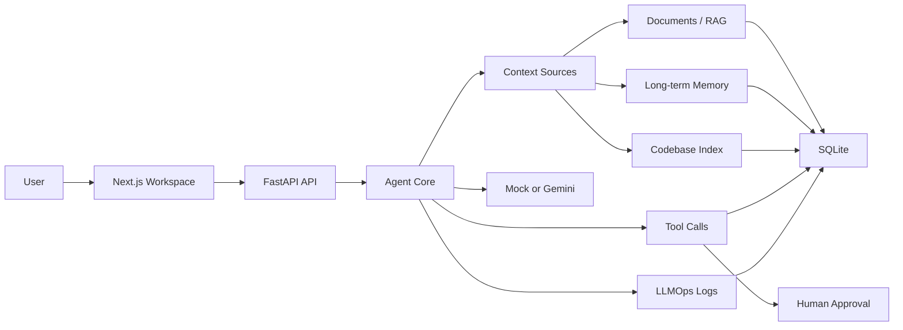
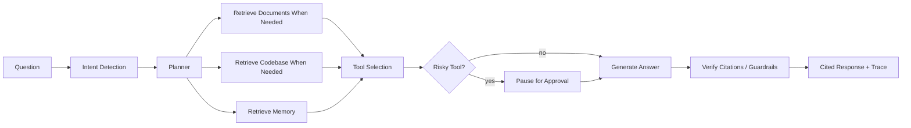

# AgentOS Lite

<p>
  <a href="https://agentos-lite-jet.vercel.app"><strong>线上试用 / Live Demo</strong></a>
  |
  <a href="https://agentos-lite-backend.onrender.com/health"><strong>后端健康检查 / Backend Health</strong></a>
  |
  <a href="#zh"><strong>中文说明</strong></a>
  |
  <a href="#en"><strong>English</strong></a>
</p>

`Next.js` `FastAPI` `Gemini` `RAG` `LLMOps` `Codebase Intelligence` `Human Approval` `Mock fallback`

<a id="zh"></a>

## 中文说明

AgentOS Lite 是一个本地优先的 AI Agent 工作台，集成 RAG 文档问答、长期记忆、工具调用、人工审批、LLMOps、Gemini 可选接入和代码库智能分析。

它不是普通聊天机器人。普通 chatbot 通常是“输入问题 -> 输出回答”；AgentOS Lite 会把每次回答建模为一次 `Agent Run`：先检索文档、记忆和代码库上下文，再进行意图识别、计划、工具选择、风险判断、人工审批、引用验证和 LLMOps 记录。

默认模式成本为 `$0`：没有 API key 也能运行完整核心流程。只有当你显式配置自己的 Gemini API key 时，后端才会使用真实 Gemini；线上 Demo 已开启每日调用限制，超限后自动回退到 mock。

### 直接线上试用

如果你只是想体验项目，不需要自己部署，直接打开：

- [线上 Demo](https://agentos-lite-jet.vercel.app)
- [后端健康检查](https://agentos-lite-backend.onrender.com/health)

线上 Demo 使用 Vercel 前端 + Render FastAPI 后端。为了保护 Gemini API key，每个匿名 session 每个 UTC 自然日最多 5 次真实 Gemini 调用；超过后会自动使用本地 mock fallback，并在 LLMOps 中记录 `fallback_reason=demo_daily_limit`。

Render 免费服务可能会冷启动，所以第一次打开后端或页面时可能需要等待几十秒。

### 你可以怎么试

1. 打开 [线上 Demo](https://agentos-lite-jet.vercel.app)。
2. 进入 `Settings`，查看当前模式、Gemini 状态、每日调用限制和 fallback 设置。
3. 进入 `Chat`，提问：`What can AgentOS Lite do?`
4. 进入 `Documents`，加载或上传 sample Markdown 文档，再让 Chat 总结文档并查看 citations。
5. 进入 `Memory`，添加一个偏好，例如“用简洁技术语言解释”，再回到 Chat 提问。
6. 进入 `Codebase`，索引 sample repo 或 AgentOS Lite 自身，提问：`Explain the architecture of this repo.`
7. 提问：`Generate test suggestions for Gemini provider.`
8. 进入 `Tools / Approvals`，查看工具风险等级和人工审批流程。
9. 进入 `LLMOps`，查看 Agent Run、provider、latency、fallback reason、retrieval logs 和 tool calls。

### 核心功能

- **Chat Workspace**：展示回答、引用、Agent trace、工具调用和审批状态。
- **Documents / RAG**：支持 TXT/Markdown 上传、chunk preview、reindex/delete、标题/关键词检索、snippet citation 和 strict citation mode。
- **Long-term Memory**：保存用户偏好、项目上下文、工具结果和 notes，让回答能使用长期上下文。
- **Tool Calling**：工具分为 `safe`、`approval_required`、`blocked` 三类风险等级。
- **Human Approval**：高风险工具调用会暂停，等待用户 approve/reject。
- **Codebase Intelligence**：使用 Python `ast` 和轻量 TS/JS parser 索引代码库，支持架构解释、相关文件定位和测试建议生成。
- **LLMOps Dashboard**：记录 agent runs、model calls、retrieval logs、tool calls、错误、延迟、provider 和 fallback 状态。
- **Gemini Optional Provider**：Gemini 是可选真实模型，所有 secret 只从环境变量读取；mock fallback 始终可用。

### 技术栈与专业知识

- **Frontend**：Next.js、TypeScript、Tailwind CSS
- **Backend**：FastAPI、Python、Pydantic
- **Database**：SQLite，本地 MVP 和 demo 计数使用
- **AI Provider**：默认 MockLLMProvider，可选 GeminiProvider
- **RAG**：文本抽取、chunking、mock embeddings、关键词/标题检索、citation snippets
- **Agent Workflow**：intent detection、planning、memory retrieval、RAG retrieval、tool selection、verification
- **Safety**：approval flow、blocked tools、strict citation mode、API key 不落库不展示
- **Observability**：LLMOps、latency、estimated tokens、fallback reason、retrieval debug info
- **Deployment**：Vercel frontend + Render backend，demo mode 每 session 每天 5 次真实 Gemini 调用限制

### 系统架构



### Agent 工作流



### 本地运行

本地运行有两种方式：默认 mock 零成本模式，或者填入你自己的 Gemini key。

```powershell
git clone https://github.com/KemiZHANG/agentos-lite.git
cd agentos-lite
Copy-Item .env.example backend/.env
```

默认 mock 模式可以直接运行，保持：

```env
APP_ENV=local
LLM_PROVIDER=mock
LLM_FALLBACK_TO_MOCK=true
DEMO_MODE=false
```

启动后端：

```powershell
.\scripts\start_backend.ps1
```

后端默认地址是 `http://127.0.0.1:8010`。直接打开根路径可能显示 `Not Found`，这是正常的；请访问 `/health`、`/settings`，或通过前端使用。

另开一个终端启动前端：

```powershell
.\scripts\start_frontend.ps1
```

打开 `http://localhost:3000`。如果 3000 被占用，Next.js 可能会自动使用 3001，请以终端显示为准。

后端检查：

```powershell
.\scripts\check_backend.ps1
```

### 本地 Gemini 模式

编辑 `backend/.env`：

```env
APP_ENV=local
LLM_PROVIDER=gemini
GEMINI_API_KEY=
GEMINI_MODEL=gemini-3.1-pro-preview
LLM_FALLBACK_TO_MOCK=true
DEMO_MODE=false
```

重启后端，进入 `Settings`，点击 `Test Provider`。`backend/.env` 已被 Git 忽略，不要提交真实 API key。

### 自己部署

如果你只是想体验项目，不需要部署，直接使用上面的线上 Demo 即可。

部署说明是给想 fork/self-host 的用户准备的：前端部署到 Vercel，后端部署到 Render Free Web Service。Render 需要配置 `APP_ENV=production`、`LLM_PROVIDER=gemini`、`GEMINI_API_KEY`、`DEMO_MODE=true`、`MAX_LLM_CALLS_PER_USER_PER_DAY=5` 和 `CORS_ORIGINS`。完整步骤见 [docs/DEPLOYMENT.md](docs/DEPLOYMENT.md)。

### 验证命令

Backend:

```powershell
$env:PYTHONPATH="backend"
pytest backend\app\tests
python -c "from app.main import app; print(app.title)"
```

Frontend:

```powershell
cd frontend
npm run typecheck
npm run build
```

### 已知限制

这是作品集和本地优先 MVP，不是生产 SaaS。当前版本使用 SQLite、mock embeddings、默认本地用户和 Render 免费服务。Render 免费服务会冷启动，文件系统也可能在重启或重新部署后丢失数据。长期生产化可在后续接入稳定数据库、真实向量检索、用户系统和后台任务队列。

### 更多文档

- [User Guide](docs/USER_GUIDE.md)
- [Product Scope](docs/PRODUCT_SCOPE.md)
- [Product Story](docs/PRODUCT_STORY.md)
- [Architecture](docs/ARCHITECTURE.md)
- [Provider Setup](docs/PROVIDER_SETUP.md)
- [Deployment](docs/DEPLOYMENT.md)
- [RAG Pipeline](docs/RAG_PIPELINE.md)
- [Codebase Skill](docs/CODEBASE_SKILL.md)
- [LLMOps](docs/LLMOPS.md)
- [Security and Guardrails](docs/SECURITY_AND_GUARDRAILS.md)
- [Demo Script](docs/DEMO_SCRIPT.md)
- [Manual QA Checklist](docs/MANUAL_QA_CHECKLIST.md)
- [Resume Bullets](docs/RESUME_BULLETS.md)

<a id="en"></a>

## English

AgentOS Lite is a local-first AI Agent workspace with RAG, memory, tool execution, human approval, LLMOps, optional Gemini integration, and codebase intelligence.

It is not just a chatbot. A normal chatbot usually stops at prompt in and answer out. AgentOS Lite models each answer as an `Agent Run`: it retrieves document, memory, and codebase context; plans the response; selects tools; checks tool risk; pauses for human approval when needed; verifies citations; and records the full process in LLMOps.

Default mode costs `$0`: the backend uses `MockLLMProvider` and `MockEmbeddingProvider` unless you explicitly enable Gemini with your own API key.

### Try Online

You do not need to deploy anything to try the project:

- [Live Demo](https://agentos-lite-jet.vercel.app)
- [Backend Health](https://agentos-lite-backend.onrender.com/health)

The hosted demo uses a Vercel frontend and a Render FastAPI backend. To protect the Gemini API key, each anonymous session gets up to 5 real Gemini calls per UTC day. After that, AgentOS Lite automatically uses mock fallback and records `fallback_reason=demo_daily_limit` in LLMOps.

Render free services may cold start, so the first request can take a little longer.

### Suggested Demo Flow

1. Open the Live Demo.
2. Check `Settings` for current mode, provider status, daily limit, and fallback.
3. Ask Chat: `What can AgentOS Lite do?`
4. Load or upload a sample Markdown document in `Documents`.
5. Ask Chat to summarize the uploaded document and inspect citations.
6. Add a memory preference, then ask how answers should be tailored.
7. Index the sample repo or AgentOS Lite itself in `Codebase`.
8. Ask: `Explain the architecture of this repo.`
9. Ask: `Generate test suggestions for Gemini provider.`
10. Open `Tools / Approvals` and `LLMOps` to inspect tool risk, traces, provider status, latency, and fallback reason.

### Key Features

- Web chat with citations, agent trace steps, tool calls, and approval-required state.
- Document RAG for TXT/Markdown uploads, chunk preview, title/keyword retrieval, snippets, and strict citation mode.
- Long-term memory for user preferences, project context, tool results, and notes.
- Tool calling with `safe`, `approval_required`, and `blocked` risk levels.
- Human-in-the-loop approval for risky actions.
- Codebase Intelligence using Python `ast` and lightweight TS/JS parsing for architecture answers, related-file search, and test suggestions.
- LLMOps dashboard for agent runs, model calls, retrieval logs, tool calls, errors, latency, provider status, and fallback state.
- Optional Gemini provider with environment-only secrets and mock fallback.

### Local Run

```powershell
git clone https://github.com/KemiZHANG/agentos-lite.git
cd agentos-lite
Copy-Item .env.example backend/.env
.\scripts\start_backend.ps1
```

Open another terminal:

```powershell
.\scripts\start_frontend.ps1
```

Open `http://localhost:3000`. Keep `LLM_PROVIDER=mock` for the zero-cost local mode.

### Optional Gemini Mode

Edit `backend/.env`:

```env
APP_ENV=local
LLM_PROVIDER=gemini
GEMINI_API_KEY=
GEMINI_MODEL=gemini-3.1-pro-preview
LLM_FALLBACK_TO_MOCK=true
DEMO_MODE=false
```

Restart the backend, open `Settings`, and click `Test Provider`. Never commit `backend/.env`.

### Self-hosting

The public demo is already available. Self-hosting is only needed if you want to fork and run your own hosted copy. Use Vercel for `frontend/` and Render Free Web Service for the FastAPI backend. See [docs/DEPLOYMENT.md](docs/DEPLOYMENT.md) for details.

### Validation

```powershell
$env:PYTHONPATH="backend"
pytest backend\app\tests
python -c "from app.main import app; print(app.title)"
cd frontend
npm run typecheck
npm run build
```

### Roadmap

- Real embeddings and vector search.
- Authentication and multi-user workspaces.
- Background indexing and scheduled task execution.
- PDF extraction with a dedicated parser.
- PostgreSQL/pgvector as a later production path.
