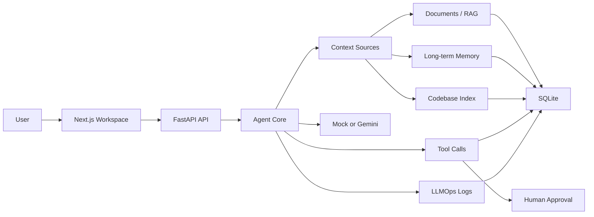
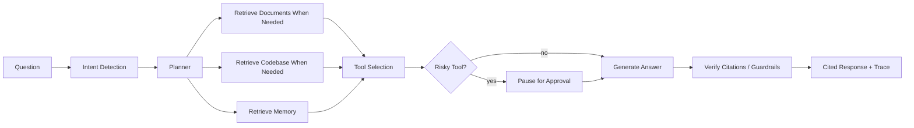
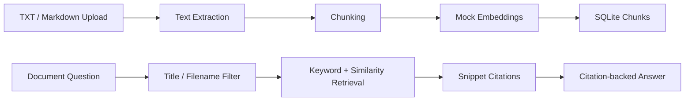

# AgentOS Lite

AgentOS Lite is a local-first AI Agent workspace MVP with RAG, long-term memory, tool execution, human approval, LLMOps, and codebase intelligence. It is designed as a portfolio-ready project that shows the full AI application loop, not just a chatbot.

Default mode costs `$0`: the backend uses `MockLLMProvider` and `MockEmbeddingProvider` unless you explicitly enable Gemini with your own API key.

## Why This Project

Most demo chatbots stop at prompt in, answer out. AgentOS Lite demonstrates the product architecture around an AI agent:

User question -> context retrieval from documents, memory, and codebase -> agent planning -> tool selection -> human approval for risky actions -> cited answer -> LLMOps trace for diagnosis.

## Core Features

- Web chat with citations, trace steps, tool calls, approval-required state, and bilingual response preference.
- Documents knowledge base for TXT/Markdown uploads, chunk preview, reindex/delete, keyword/title retrieval, snippets, and strict citation mode.
- Long-term memory CRUD for user preferences, project context, tool results, and notes.
- Tool framework with `safe`, `approval_required`, and `blocked` risk levels.
- Human-in-the-loop approvals for risky tool calls.
- Codebase Intelligence Skill using Python `ast` and lightweight TS/JS parsing for architecture answers, file location, and test suggestions.
- LLMOps dashboard for agent runs, model calls, retrieval logs, tool calls, errors, latency, and fallback state.
- Optional Gemini provider with safe env-based configuration; mock fallback stays available.

## Tech Stack

- Frontend: Next.js, TypeScript, Tailwind CSS
- Backend: FastAPI, Python, Pydantic
- Database: SQLite for local MVP
- AI: Mock provider by default, optional Gemini
- Retrieval: local keyword/title scoring plus mock embeddings
- Codebase parser: Python `ast`, lightweight TypeScript/JavaScript regex parser

## Architecture



## Agent Workflow



## RAG Pipeline



## Windows Quick Start

1. Clone the repo:

```powershell
git clone https://github.com/KemiZHANG/agentos-lite.git
cd agentos-lite
```

2. Copy the example env file:

```powershell
Copy-Item .env.example backend/.env
```

3. Default mock mode can run immediately and costs `$0`. Keep these values for local demo mode:

```env
LLM_PROVIDER=mock
LLM_FALLBACK_TO_MOCK=true
```

4. Optional Gemini mode: edit `backend/.env` and fill only your local key:

```env
LLM_PROVIDER=gemini
GEMINI_API_KEY=your-local-key
GEMINI_MODEL=gemini-3.1-pro-preview
LLM_FALLBACK_TO_MOCK=true
```

Never commit `backend/.env`.

5. Start backend in one terminal:

```powershell
.\scripts\start_backend.ps1
```

The backend defaults to `http://127.0.0.1:8010`.

6. Start frontend in another terminal:

```powershell
.\scripts\start_frontend.ps1
```

Open `http://localhost:3000`. If port `3000` is busy, Next.js may use `3001`; follow the URL printed in the terminal.

7. Open Settings and click `Test Provider`.

Useful backend check:

```powershell
.\scripts\check_backend.ps1
```

Notes:

- Opening `http://127.0.0.1:8010` may show `Not Found`; that is normal. Use `/health`, `/settings`, or the frontend.
- If port `8000` fails with `WinError 10013`, use the included scripts on `8010`.
- Mock mode is the safest way to record demos without API costs.
- Gemini mode is optional and uses your own API key.

Optional demo seed:

```powershell
cd backend
$env:PYTHONPATH=".."
python ..\scripts\seed_demo.py
```

## Gemini Setup

Mock mode is the default and costs `$0`. To test Gemini locally, create `backend/.env` or root `.env`:

```env
LLM_PROVIDER=gemini
GEMINI_API_KEY=your-local-key
GEMINI_MODEL=gemini-3.1-pro-preview
LLM_FALLBACK_TO_MOCK=true
```

`backend/.env` and root `.env` are ignored by Git. The Settings page shows only whether a key is configured, never the key value. The provider health check only calls Gemini when you click `Test Provider`.

For public demos, set:

```env
DEMO_MODE=true
MAX_LLM_CALLS_PER_SESSION=20
MAX_LLM_CALLS_PER_DAY=100
```

When Gemini is missing, fails, or hits a demo limit, AgentOS Lite can answer with local mock fallback and records the fallback reason in LLMOps.

## Demo Flow

1. Open Overview and explain the workspace loop.
2. Open Settings and show `mock` or optional `gemini` provider status.
3. Ask Chat: `What can AgentOS Lite do?`
4. Upload `examples/sample_docs/product_brief.md` in Documents.
5. Ask Chat: `Summarize the uploaded product brief.`
6. Add a memory preference, then ask how explanations should be tailored.
7. Index the sample repo or current AgentOS Lite repo in Codebase.
8. Ask architecture, file-location, and test-suggestion questions.
9. Trigger a risky tool and approve/reject it in Tools.
10. Open LLMOps to inspect trace steps, model calls, retrieval logs, and fallback state.

## Validation

Backend:

```powershell
$env:PYTHONPATH="backend"
pytest backend\app\tests
python -c "from app.main import app; print(app.title)"
```

Frontend:

```powershell
cd frontend
npm run typecheck
npm run build
```

## Roadmap

- Real embeddings and vector search after the local MVP is stable.
- Authentication and multi-user workspaces.
- Background indexing and scheduled task execution.
- PDF extraction with a dedicated parser.
- More provider retry/rate-limit controls around Gemini.
- PostgreSQL/pgvector migration as a later production path.

## Known Limitations

See [docs/KNOWN_LIMITATIONS.md](docs/KNOWN_LIMITATIONS.md). The short version: this is a local MVP, not a hosted production service. It intentionally uses SQLite, mock embeddings, deterministic mock responses, and a default local user.

## Resume Bullets

See [docs/RESUME_BULLETS.md](docs/RESUME_BULLETS.md) for short, standard, keyword-focused, and interview-ready versions.

## More Docs

- [User Guide](docs/USER_GUIDE.md)
- [Product Scope](docs/PRODUCT_SCOPE.md)
- [Product Story](docs/PRODUCT_STORY.md)
- [Architecture](docs/ARCHITECTURE.md)
- [Provider Setup](docs/PROVIDER_SETUP.md)
- [RAG Pipeline](docs/RAG_PIPELINE.md)
- [Codebase Skill](docs/CODEBASE_SKILL.md)
- [LLMOps](docs/LLMOPS.md)
- [Security and Guardrails](docs/SECURITY_AND_GUARDRAILS.md)
- [Demo Script](docs/DEMO_SCRIPT.md)
- [Manual QA Checklist](docs/MANUAL_QA_CHECKLIST.md)
