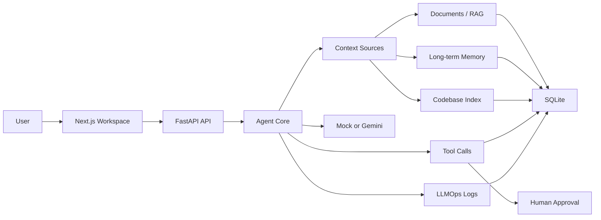
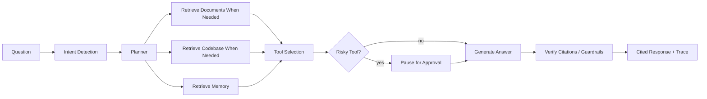
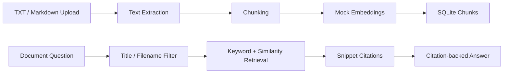
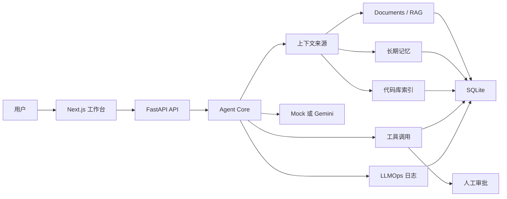
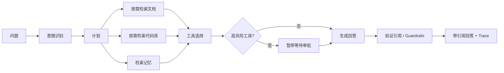
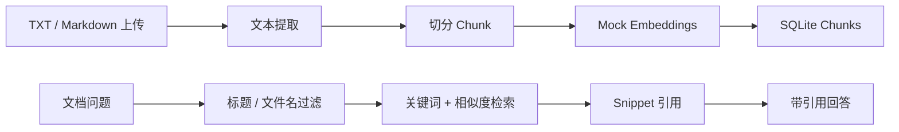

# AgentOS Lite

<p>
  <a href="https://agentos-lite-jet.vercel.app"><strong>Live Demo</strong></a>
  |
  <a href="https://agentos-lite-backend.onrender.com/health"><strong>Backend Health</strong></a>
  |
  <a href="#english"><strong>English</strong></a>
  |
  <a href="#中文"><strong>中文</strong></a>
</p>

`Next.js` `FastAPI` `Gemini` `RAG` `LLMOps` `Codebase Intelligence` `Mock fallback`

<details open>
<summary id="english"><strong>English</strong></summary>

## Overview

AgentOS Lite is a local-first AI Agent workspace with RAG, memory, tool execution, human approval, LLMOps, Gemini integration, and codebase intelligence.

Default mode costs `$0`: the backend uses `MockLLMProvider` and `MockEmbeddingProvider` unless you explicitly enable Gemini with your own API key.

Why it is not just a chatbot: AgentOS Lite models every answer as an Agent Run with context retrieval, planning, tool risk handling, human approval, citations, provider fallback, and LLMOps diagnostics.

## Key Features

- Live hosted demo with Vercel frontend and Render FastAPI backend.
- Local mock mode for full zero-cost demos without API keys.
- Optional Gemini mode with environment-only secrets and mock fallback.
- RAG document answers with chunk citations and snippets.
- Long-term memory, tool execution, approval workflow, Codebase Intelligence, and LLMOps traceability.
- Hosted demo protection with 5 real Gemini calls per anonymous session per UTC day, then mock fallback.

## How To Use This Project

### Option A: Local Mock Mode, Free

Use this when you want to clone the repo and explore the full product loop with no API key and no cost.

```powershell
git clone https://github.com/KemiZHANG/agentos-lite.git
cd agentos-lite
Copy-Item .env.example backend/.env
.\scripts\start_backend.ps1
```

Open another terminal:

```powershell
.\scripts\start_frontend.ps1
```

Open `http://localhost:3000`. Keep `LLM_PROVIDER=mock`.

### Option B: Local Gemini Mode

Use this when you want real Gemini answers with your own local key.

```powershell
Copy-Item .env.example backend/.env
```

Edit `backend/.env`:

```env
APP_ENV=local
LLM_PROVIDER=gemini
GEMINI_API_KEY=
GEMINI_MODEL=gemini-3.1-pro-preview
LLM_FALLBACK_TO_MOCK=true
DEMO_MODE=false
```

Restart the backend, open Settings, and click `Test Provider`.

### Option C: Hosted Demo Mode

Use this for a zero-cost portfolio demo:

- Deploy `frontend/` to Vercel.
- Deploy the FastAPI backend to Render Free Web Service.
- Set `NEXT_PUBLIC_API_BASE_URL` in Vercel to the Render backend URL.
- Set backend env vars on Render:

```env
PYTHON_VERSION=3.12.8
APP_ENV=production
LLM_PROVIDER=gemini
GEMINI_API_KEY=
GEMINI_MODEL=gemini-3.1-pro-preview
LLM_FALLBACK_TO_MOCK=true
DEMO_MODE=true
MAX_LLM_CALLS_PER_USER_PER_DAY=5
DEMO_FALLBACK_TO_MOCK=true
CORS_ORIGINS=https://your-vercel-app.vercel.app
```

Hosted demo mode limits each anonymous session to 5 real Gemini calls per UTC day. After that, AgentOS Lite automatically uses mock fallback and records `fallback_reason=demo_daily_limit` in LLMOps.

## Why This Project

Most demo chatbots stop at prompt in, answer out. AgentOS Lite demonstrates the product architecture around an AI agent:

```text
User question
-> context retrieval from documents, memory, and codebase
-> agent planning
-> tool selection
-> human approval for risky actions
-> cited answer
-> LLMOps trace for diagnosis
```

## Core Features

- Web chat with citations, trace steps, tool calls, approval-required state, and bilingual response preference.
- Documents knowledge base for TXT/Markdown uploads, chunk preview, reindex/delete, keyword/title retrieval, snippets, and strict citation mode.
- Long-term memory CRUD for user preferences, project context, tool results, and notes.
- Tool framework with `safe`, `approval_required`, and `blocked` risk levels.
- Human-in-the-loop approvals for risky tool calls.
- Codebase Intelligence Skill using Python `ast` and lightweight TS/JS parsing for architecture answers, file location, and test suggestions.
- LLMOps dashboard for agent runs, model calls, retrieval logs, tool calls, errors, latency, and fallback state.
- Optional Gemini provider with safe env-based configuration; mock fallback stays available.

## Tech Stack

- Frontend: Next.js, TypeScript, Tailwind CSS
- Backend: FastAPI, Python, Pydantic
- Database: SQLite for local MVP
- AI: Mock provider by default, optional Gemini
- Retrieval: local keyword/title scoring plus mock embeddings
- Codebase parser: Python `ast`, lightweight TypeScript/JavaScript regex parser

## Architecture



## Agent Workflow



## RAG Pipeline



## Windows Quick Start

1. Clone the repo:

```powershell
git clone https://github.com/KemiZHANG/agentos-lite.git
cd agentos-lite
```

2. Copy the example env file:

```powershell
Copy-Item .env.example backend/.env
```

3. Default mock mode can run immediately and costs `$0`:

```env
APP_ENV=local
LLM_PROVIDER=mock
LLM_FALLBACK_TO_MOCK=true
DEMO_MODE=false
```

4. Optional Gemini mode: edit `backend/.env` and fill only your local key:

```env
LLM_PROVIDER=gemini
GEMINI_API_KEY=
GEMINI_MODEL=gemini-3.1-pro-preview
LLM_FALLBACK_TO_MOCK=true
DEMO_MODE=false
```

Never commit `backend/.env`.

5. Start backend in one terminal:

```powershell
.\scripts\start_backend.ps1
```

The backend defaults to `http://127.0.0.1:8010`.

6. Start frontend in another terminal:

```powershell
.\scripts\start_frontend.ps1
```

Open `http://localhost:3000`. If port `3000` is busy, Next.js may use `3001`; follow the URL printed in the terminal.

Useful backend check:

```powershell
.\scripts\check_backend.ps1
```

Notes:

- Opening `http://127.0.0.1:8010` may show `Not Found`; that is normal. Use `/health`, `/settings`, or the frontend.
- If port `8000` fails with `WinError 10013`, use the included scripts on `8010`.
- Mock mode is the safest way to record demos without API costs.
- Gemini mode is optional and uses your own API key.

Optional demo seed:

```powershell
cd backend
$env:PYTHONPATH=".."
python ..\scripts\seed_demo.py
```

## Gemini Setup

Mock mode is the default and costs `$0`. To test Gemini locally, create `backend/.env` or root `.env`:

```env
APP_ENV=local
LLM_PROVIDER=gemini
GEMINI_API_KEY=
GEMINI_MODEL=gemini-3.1-pro-preview
LLM_FALLBACK_TO_MOCK=true
DEMO_MODE=false
```

`backend/.env` and root `.env` are ignored by Git. The Settings page shows only whether a key is configured, never the key value. The provider health check only calls Gemini when you click `Test Provider`.

For public demos, set:

```env
APP_ENV=production
LLM_PROVIDER=gemini
DEMO_MODE=true
MAX_LLM_CALLS_PER_USER_PER_DAY=5
DEMO_FALLBACK_TO_MOCK=true
```

When Gemini is missing, fails, or hits a demo limit, AgentOS Lite can answer with local mock fallback and records the fallback reason in LLMOps.

## Demo Flow

1. Open Overview and explain the workspace loop.
2. Open Settings and show `mock` or optional `gemini` provider status.
3. Ask Chat: `What can AgentOS Lite do?`
4. Upload `examples/sample_docs/product_brief.md` in Documents.
5. Ask Chat: `Summarize the uploaded product brief.`
6. Add a memory preference, then ask how explanations should be tailored.
7. Index the sample repo or current AgentOS Lite repo in Codebase.
8. Ask architecture, file-location, and test-suggestion questions.
9. Trigger a risky tool and approve/reject it in Tools.
10. Open LLMOps to inspect trace steps, model calls, retrieval logs, and fallback state.

## Validation

Backend:

```powershell
$env:PYTHONPATH="backend"
pytest backend\app\tests
python -c "from app.main import app; print(app.title)"
```

Frontend:

```powershell
cd frontend
npm run typecheck
npm run build
```

## Roadmap

- Real embeddings and vector search after the local MVP is stable.
- Authentication and multi-user workspaces.
- Background indexing and scheduled task execution.
- PDF extraction with a dedicated parser.
- More provider retry/rate-limit controls around Gemini.
- PostgreSQL/pgvector migration as a later production path.

## Known Limitations

See [docs/KNOWN_LIMITATIONS.md](docs/KNOWN_LIMITATIONS.md). The short version: this is a local MVP, not a hosted production service. It intentionally uses SQLite, mock embeddings, deterministic mock responses, and a default local user.

## Resume Bullets

See [docs/RESUME_BULLETS.md](docs/RESUME_BULLETS.md) for short, standard, keyword-focused, and interview-ready versions.

## More Docs

- [User Guide](docs/USER_GUIDE.md)
- [Product Scope](docs/PRODUCT_SCOPE.md)
- [Product Story](docs/PRODUCT_STORY.md)
- [Architecture](docs/ARCHITECTURE.md)
- [Provider Setup](docs/PROVIDER_SETUP.md)
- [Deployment](docs/DEPLOYMENT.md)
- [RAG Pipeline](docs/RAG_PIPELINE.md)
- [Codebase Skill](docs/CODEBASE_SKILL.md)
- [LLMOps](docs/LLMOPS.md)
- [Security and Guardrails](docs/SECURITY_AND_GUARDRAILS.md)
- [Demo Script](docs/DEMO_SCRIPT.md)
- [Manual QA Checklist](docs/MANUAL_QA_CHECKLIST.md)

</details>

<details>
<summary id="中文"><strong>中文</strong></summary>

## 项目简介

AgentOS Lite 是一个本地优先的 AI Agent 工作台，集成 RAG、长期记忆、工具执行、人工审批、LLMOps、Gemini 和代码库智能。

默认模式成本为 `$0`：除非你显式配置自己的 Gemini API key，否则后端会使用 `MockLLMProvider` 和 `MockEmbeddingProvider`。

它不是普通聊天机器人：AgentOS Lite 会把每次回答建模为一个 Agent Run，包含上下文检索、计划、工具风险判断、人工审批、引用、provider fallback 和 LLMOps 诊断。

## 核心功能

- 已部署线上 Demo：Vercel 前端 + Render FastAPI 后端。
- 本地 mock 模式：无需 API key，也能完整体验产品闭环。
- 可选 Gemini 模式：密钥只来自环境变量，并保留 mock fallback。
- RAG 文档问答：回答带 chunk 引用、snippet 和可验证证据。
- 长期记忆、工具执行、人工审批、代码库智能和 LLMOps 可观测性。
- 线上 Demo 保护：每个匿名 session 每 UTC 天最多 5 次真实 Gemini 调用，超限后自动 mock fallback。

## 如何使用这个项目

### 方式 A：本地 Mock 模式，免费

适合 clone 后无 API key、零成本体验完整产品流程。

```powershell
git clone https://github.com/KemiZHANG/agentos-lite.git
cd agentos-lite
Copy-Item .env.example backend/.env
.\scripts\start_backend.ps1
```

另开一个终端：

```powershell
.\scripts\start_frontend.ps1
```

打开 `http://localhost:3000`。保持 `LLM_PROVIDER=mock`。

### 方式 B：本地 Gemini 模式

适合使用你自己的 Gemini key 测试真实模型回答。

```powershell
Copy-Item .env.example backend/.env
```

编辑 `backend/.env`：

```env
APP_ENV=local
LLM_PROVIDER=gemini
GEMINI_API_KEY=
GEMINI_MODEL=gemini-3.1-pro-preview
LLM_FALLBACK_TO_MOCK=true
DEMO_MODE=false
```

重启后端，打开 Settings，点击 `Test Provider`。

### 方式 C：线上 Demo 模式

适合作为零成本作品集 Demo：

- 将 `frontend/` 部署到 Vercel。
- 将 FastAPI 后端部署到 Render Free Web Service。
- 在 Vercel 设置 `NEXT_PUBLIC_API_BASE_URL` 指向 Render 后端地址。
- 在 Render 设置后端环境变量：

```env
PYTHON_VERSION=3.12.8
APP_ENV=production
LLM_PROVIDER=gemini
GEMINI_API_KEY=
GEMINI_MODEL=gemini-3.1-pro-preview
LLM_FALLBACK_TO_MOCK=true
DEMO_MODE=true
MAX_LLM_CALLS_PER_USER_PER_DAY=5
DEMO_FALLBACK_TO_MOCK=true
CORS_ORIGINS=https://your-vercel-app.vercel.app
```

线上 Demo 每个匿名 session 每 UTC 天最多 5 次真实 Gemini 调用。超过后，AgentOS Lite 会自动使用 mock fallback，并在 LLMOps 中记录 `fallback_reason=demo_daily_limit`。

## 为什么做这个项目

大多数 demo chatbot 只展示 prompt 输入和文本输出。AgentOS Lite 展示的是 AI Agent 产品架构：

```text
用户问题
-> 从文档、记忆、代码库检索上下文
-> Agent 计划
-> 工具选择
-> 高风险操作人工审批
-> 带引用的回答
-> LLMOps 记录和诊断
```

## 核心模块

- Web Chat：显示引用、trace steps、tool calls、approval-required 状态和中英响应偏好。
- Documents 知识库：支持 TXT/Markdown 上传、chunk preview、reindex/delete、关键词/标题检索、snippet 和 strict citation mode。
- Long-term Memory：支持用户偏好、项目上下文、工具结果和 note 的 CRUD。
- Tool Framework：工具风险等级包括 `safe`、`approval_required`、`blocked`。
- Human-in-the-loop：高风险工具调用需要人工审批。
- Codebase Intelligence：使用 Python `ast` 和轻量 TS/JS 解析，支持架构说明、文件定位和测试建议。
- LLMOps Dashboard：展示 agent runs、model calls、retrieval logs、tool calls、错误、延迟和 fallback 状态。
- Gemini Provider：可选真实模型配置，mock fallback 始终可用。

## 技术栈

- 前端：Next.js、TypeScript、Tailwind CSS
- 后端：FastAPI、Python、Pydantic
- 数据库：SQLite，本地 MVP 使用
- AI：默认 mock provider，可选 Gemini
- 检索：本地关键词/标题打分 + mock embeddings
- 代码库解析：Python `ast`，轻量 TypeScript/JavaScript regex parser

## 系统架构



## Agent 工作流



## RAG 流程



## Windows 快速启动

1. Clone 仓库：

```powershell
git clone https://github.com/KemiZHANG/agentos-lite.git
cd agentos-lite
```

2. 复制示例环境变量文件：

```powershell
Copy-Item .env.example backend/.env
```

3. 默认 mock 模式可以直接运行，成本为 `$0`：

```env
APP_ENV=local
LLM_PROVIDER=mock
LLM_FALLBACK_TO_MOCK=true
DEMO_MODE=false
```

4. 可选 Gemini 模式：编辑 `backend/.env`，只填写你自己的本地 key：

```env
LLM_PROVIDER=gemini
GEMINI_API_KEY=
GEMINI_MODEL=gemini-3.1-pro-preview
LLM_FALLBACK_TO_MOCK=true
DEMO_MODE=false
```

不要提交 `backend/.env`。

5. 在一个终端启动后端：

```powershell
.\scripts\start_backend.ps1
```

后端默认地址是 `http://127.0.0.1:8010`。

6. 在另一个终端启动前端：

```powershell
.\scripts\start_frontend.ps1
```

打开 `http://localhost:3000`。如果 `3000` 被占用，Next.js 可能使用 `3001`，以终端显示为准。

后端检查：

```powershell
.\scripts\check_backend.ps1
```

说明：

- 打开 `http://127.0.0.1:8010` 可能显示 `Not Found`，这是正常的。请使用 `/health`、`/settings` 或前端页面。
- 如果 `8000` 端口遇到 `WinError 10013`，请使用项目脚本默认的 `8010`。
- Mock 模式最适合零成本录制 demo。
- Gemini 是可选模式，使用你自己的 API key。

可选示例数据：

```powershell
cd backend
$env:PYTHONPATH=".."
python ..\scripts\seed_demo.py
```

## Gemini 配置

Mock 模式是默认模式，成本为 `$0`。如果要本地测试 Gemini，请创建 `backend/.env` 或 root `.env`：

```env
APP_ENV=local
LLM_PROVIDER=gemini
GEMINI_API_KEY=
GEMINI_MODEL=gemini-3.1-pro-preview
LLM_FALLBACK_TO_MOCK=true
DEMO_MODE=false
```

`backend/.env` 和 root `.env` 都会被 Git 忽略。Settings 页面只显示 key 是否已配置，绝不会显示 key 内容。Provider health check 只有在点击 `Test Provider` 时才会调用 Gemini。

公开 Demo 推荐：

```env
APP_ENV=production
LLM_PROVIDER=gemini
DEMO_MODE=true
MAX_LLM_CALLS_PER_USER_PER_DAY=5
DEMO_FALLBACK_TO_MOCK=true
```

当 Gemini 缺失、失败或达到 demo 限制时，AgentOS Lite 可以使用本地 mock fallback，并在 LLMOps 中记录 fallback reason。

## Demo 流程

1. 打开 Overview，说明 Agent 工作台闭环。
2. 打开 Settings，展示 `mock` 或可选 `gemini` provider 状态。
3. 在 Chat 中提问：`What can AgentOS Lite do?`
4. 在 Documents 上传 `examples/sample_docs/product_brief.md`。
5. 在 Chat 中提问：`Summarize the uploaded product brief.`
6. 添加一条记忆偏好，再询问回答风格如何调整。
7. 在 Codebase 中索引 sample repo 或当前 AgentOS Lite repo。
8. 询问架构、文件定位和测试建议问题。
9. 触发一个高风险工具，并在 Tools 中 approve/reject。
10. 打开 LLMOps，查看 trace steps、model calls、retrieval logs 和 fallback 状态。

## 验证命令

后端：

```powershell
$env:PYTHONPATH="backend"
pytest backend\app\tests
python -c "from app.main import app; print(app.title)"
```

前端：

```powershell
cd frontend
npm run typecheck
npm run build
```

## 路线图

- 本地 MVP 稳定后加入真实 embeddings 和 vector search。
- 身份认证和多用户工作区。
- 后台索引和 scheduled task 执行。
- 使用专门 parser 做 PDF 抽取。
- Gemini 的重试、速率限制和更多 provider 控制。
- 后续生产化路径再迁移 PostgreSQL/pgvector。

## 已知限制

见 [docs/KNOWN_LIMITATIONS.md](docs/KNOWN_LIMITATIONS.md)。简短版：这是一个本地 MVP，不是生产级托管 SaaS。项目有意使用 SQLite、mock embeddings、确定性 mock responses 和默认本地用户。

## 简历文案

见 [docs/RESUME_BULLETS.md](docs/RESUME_BULLETS.md)，里面有短版、标准版、关键词版和面试解释版。

## 更多文档

- [用户指南](docs/USER_GUIDE.md)
- [产品范围](docs/PRODUCT_SCOPE.md)
- [产品故事](docs/PRODUCT_STORY.md)
- [架构说明](docs/ARCHITECTURE.md)
- [Provider 配置](docs/PROVIDER_SETUP.md)
- [部署指南](docs/DEPLOYMENT.md)
- [RAG 流程](docs/RAG_PIPELINE.md)
- [Codebase Skill](docs/CODEBASE_SKILL.md)
- [LLMOps](docs/LLMOPS.md)
- [安全和 Guardrails](docs/SECURITY_AND_GUARDRAILS.md)
- [Demo 脚本](docs/DEMO_SCRIPT.md)
- [手动 QA 清单](docs/MANUAL_QA_CHECKLIST.md)

</details>
